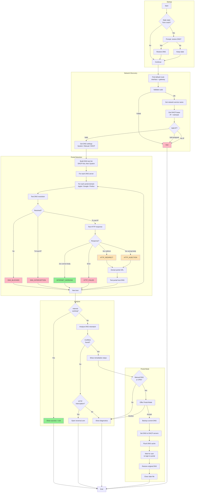

# Captive WiFi Portal Debugger - Flow Diagram

## Detection Types

| Result | Meaning |
|--------|---------|
| `DNS_BLOCKED` | DNS query failed - server unreachable or blocking |
| `DNS_INTERCEPTION` | DNS resolved to local IP - portal hijacking DNS |
| `HTTP_REDIRECT` | Got 3xx redirect to portal login page |
| `HTTP_INJECTION` | Got 2xx but body contains JS/meta redirect to portal |
| `HTTP_FAILED` | HTTP request failed - network blocked |
| `INTERNET_WORKING` | Successfully reached test endpoint |

## Portal Mode

When manual DNS or VPN is blocking portal access:

1. **Backup** current DNS configuration
2. **Set** DNS to DHCP-provided servers (what the portal expects)
3. **Flush** DNS cache
4. **Wait** for user to complete portal login
5. **Restore** original DNS configuration
6. **Clear** state file

Signal handlers ensure DNS is restored even if interrupted (Ctrl+C).
